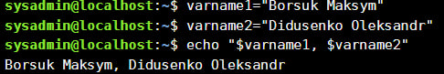
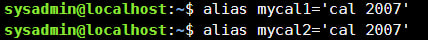
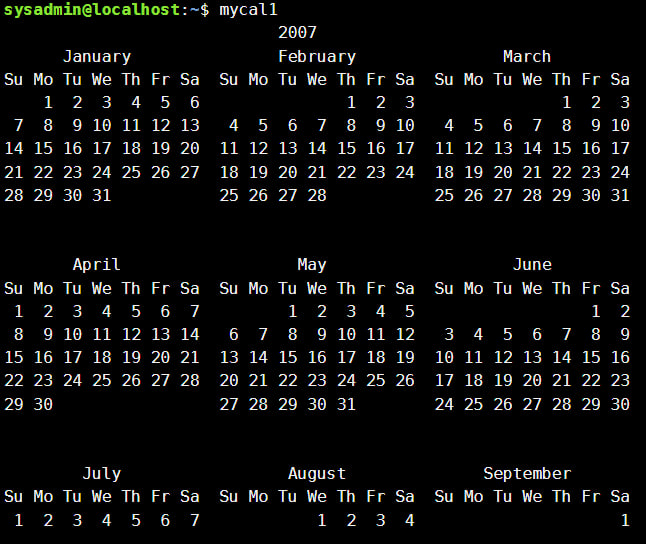
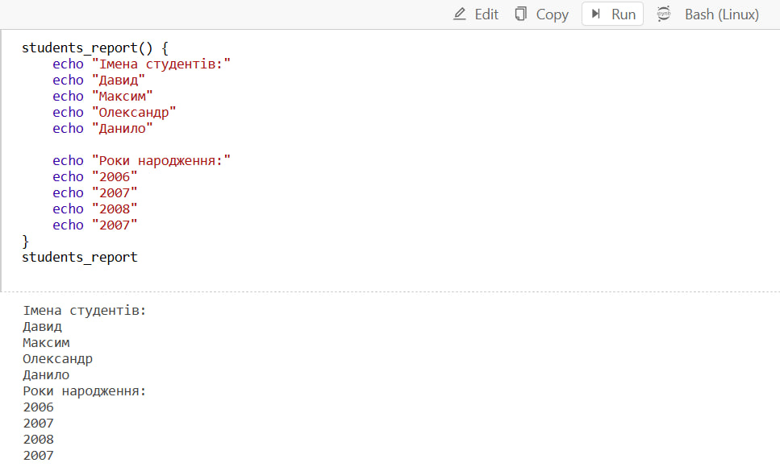
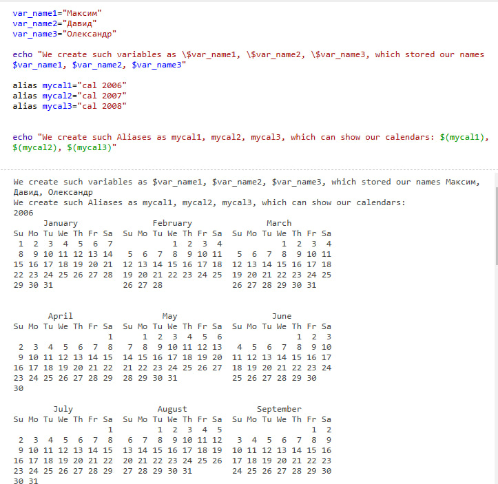
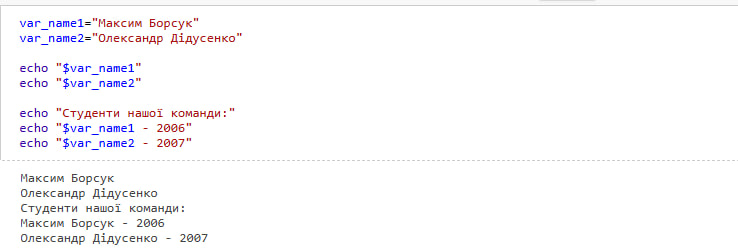
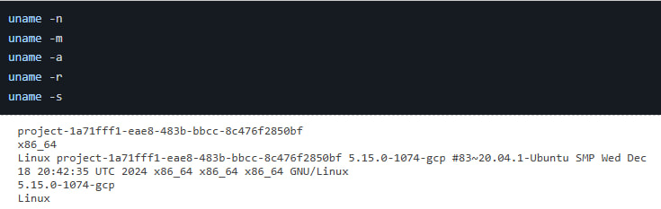

<div
 align="center">
  
</div>
<div align="center">

### **Київський фаховий коледж зв’язку**  
### *Циклова комісія комп’ютерної та програмної інженерії*  

<br/><br/><br/><br/>


### **ЗВІТ ПО ВИКОНАННЮ** 
### **ЛАБОРАТОРНОЇ РОБОТИ №2**  
### *з дисципліни: «Операційні системи»*  

  
### **Тема:** *«Ознайомлення з робочим середовищем віртуальних машин та операційних систем різних сімейств»*  

<br/>

</div>

<div align="right">

### **Виконали студенти:**  
**Групи РПЗ-23а**  
**Команда:** Борсук М.Г., Дідусенко О.Ю.  
**Перевірила:** Сушанова В.С.  

</div>

<div align="center">

<br/>

### **Київ – 2025**  

</div>


---

### Робота студентів групи РПЗ-23а Команда 1: Борсука М.Г., Дідусенка О.Ю.


## Мета роботи:  
1. Знайомство з базовими командами CLI-режиму в Linux.
2. Знайомство з базовими текстовими командами в термінальному режимі роботи в різних ОС.


---

## Матеріальне забезпечення занять  
1. ЕОМ типу IBM PC.
2. ОС сімейства Windows та віртуальна машина Virtual Box (Oracle).
3. ОС GNU/Linux (будь-який дистрибутив).
4. Сайт мережевої академії Cisco netacad.com та його онлайн курси по Linux


---

## Завдання для попередньої підготовки  
>[!IMPORTANT]
>

### 1. Прочитайте короткі теоретичні відомості до лабораторної роботи та зробіть невеликий словник базових англійських термінів з питань призначення команд та їх параметрів.
| Англійською              | Українською                                                   |
|--------------------------|---------------------------------------------------------------|
| Command Line Interface (CLI) | Інтерфейс командного рядка                                    |
| The Shell                | Оболонка (Командний інтерпретатор)                            |
| Command                  | Команда                                                       |
| Option                   | Опція                                                         |
| Argument                 | Аргумент                                                      |
| Command History          | Історія команд                                                |
| Inline Editing           | Вбудоване редагування                                          |
| Scripting                | Скриптування                                                   |
| Alias                    | Псевдонім (коротке ім'я для довших команд)                    |
| Variable                 | Змінна                                                        |
| Prompt                   | Підказка (Запрошення до введення команди)                     |
| Internal Command         | Вбудована команда                                             |
| External Command         | Зовнішня команда                                              |
| Function                 | Функція                                                       |
| Quotation Marks          | Кавычки                                                       |
| Control Statement        | Контрольна інструкція                                         |
| Semicolon (;)            | Точка з комою                                                 |
| Double Ampersand (&&)    | Подвійний амперсанд (логічне "І")                              |
| Double Pipe (||)         | Подвійний пайп (логічне "АБО")                                 |

### 4. Терміни:

1. **Command Interpreter**:  
   A program that processes and interprets commands entered by the user in a command-line interface (CLI), executing them on the operating system.

2. **Shell**:  
   A user interface that allows interaction with the operating system through command-line instructions. It acts as a command interpreter, translating user commands into actions performed by the system.

3. **Command**:  
   A specific instruction or program executed by the command-line interface (CLI) to perform a particular action, such as listing files, navigating directories, or managing system resources.

### 5. Відповіді на питання:

1. **What basic information does the prompt line provide?**  
   The prompt typically provides the following basic information:  
   - **Username**: The user currently logged into the system.  
   - **System name**: The name of the system or host.  
   - **Current Directory**: The directory the user is currently in.  
   This information helps users quickly identify their environment and the current location in the file system.

2. **Why does a command need parameters and arguments?**  
   - **Parameters** modify the behavior of the command, allowing for more specific functionality (e.g., display output in a different format).  
   - **Arguments** provide necessary additional information that the command acts upon (e.g., filenames, directory names, or other input data).

3. **What is the purpose of the `ls` command, and what parameters and arguments can it have? Provide 3 examples.**  
   The `ls` command is used to list the contents of a directory.  
   - **Parameters** modify the output format (e.g., `-l` for a long listing).  
   - **Arguments** specify the directories or files to list.  
   
   Examples:  
   - `ls` – Lists contents of the current directory.  
   - `ls -l` – Provides a detailed listing of files (permissions, ownership, size, etc.).  
   - `ls /home/user` – Lists the contents of the `/home/user` directory.

4. **How can you use the command history, and what advantages does it provide?**  
   The command history allows users to access previously entered commands using the arrow keys or the `history` command. This saves time by avoiding the need to retype long or complex commands, improving workflow efficiency.

5. **What is the purpose of the `echo` command?**  
   The `echo` command is used to display a line of text or variable content in the terminal. It is commonly used for printing output, debugging, or setting values in scripts.

6. **What is a variable in the Bash shell, and what types of variables does it support?**  
   A variable is a container that stores data that can be used within commands or scripts. There are two types of variables in Bash:  
   - **Local variables**: Defined within a script or function, only accessible in the scope where they are defined.  
   - **Environment variables**: Available to all programs and processes in the system.

7. **What is the purpose of the `env`, `export`, and `unset` commands?**  
   - `env` – Displays the current environment variables.  
   - `export` – Sets environment variables, making them available to child processes.  
   - `unset` – Removes a variable or function.

8. **Which commands can be used to get help about commands in the terminal?**  
   - `man <command>` – Displays the manual page for the specified command.  
   - `info <command>` – Displays detailed information about the command.  
   - `--help` – A common option for most commands that provides a quick reference about their usage (e.g., `ls --help`).


---

## Хід роботи  
>[!IMPORTANT]
>

## 1. Опрацюйте всі приклади команд, що представлені у лабораторній роботі курсу NDG Linux Essentials - Lab 5: Command Line Skills та Lab 6: Getting Help. Створіть таблицю для опису цих команд
| **Command**        | **Purpose and Functionality**                                                                 |
|--------------------|---------------------------------------------------------------------------------------------|
| `ls`               | Lists files and directories in the current working directory.                               |
| `ls -l`            | Lists files and directories in long format, displaying additional file information.         |
| `ls -l /home`      | Lists files and directories in long format in the specified directory.                      |
| `whoami`           | Displays the current user’s username.                                                       |
| `uname`            | Displays basic information about the system (e.g., kernel name).                            |
| `uname -n`         | Displays the network node hostname.                                                         |
| `uname --nodename` | Displays the network node hostname (same as `-n` option).                                   |
| `pwd`              | Prints the current working directory.                                                       |
| `history`          | Displays the list of recently executed commands.                                            |
| `history 5`        | Displays the last 5 commands from the history list.                                          |
| `!9`               | Executes the command listed at position 9 in the history list.                              |
| `echo`             | Prints text or the value of variables to the terminal.                                      |
| `echo $PATH`       | Displays the value of the PATH environment variable.                                        |
| `which`            | Shows the full path of an executable program.                                               |
| `type`             | Displays information about a command's type (e.g., internal or external).                  |
| `which ls`         | Shows the path to the `ls` command.                                                         |
| `type -a ls`       | Displays all locations of the `ls` command, including any aliases.                         |
| `alias`            | Displays all aliases currently set in the shell.                                            |
| `cd`               | Changes the current directory.                                                              |
| `type vi`          | Displays information about the command `vi`.                                               |
| `cd /bin`          | Changes the current directory to `/bin`.                                                    |
| `cd`               | Returns to the home directory.                                                              |
| `echo 'Hello'`     | Prints the text 'Hello', using single quotes to prevent shell expansion.                   |
| `echo "Hello"`     | Prints the text 'Hello', using double quotes for possible variable expansion.               |
| `echo \*`          | Prints the literal asterisk `*`, escaping its special meaning.                              |
| `type vlc`         | Displays information about the command `vlc`.                                               |
| `type cp`          | Shows the type of the `cp` command (usually external).                                      |
| `date`                      | Displays the current date and time.                                                  |
| `man`                       | Opens the manual page for a given command, providing details on how to use it. Example: `man date` opens the manual for the `date` command. |
| `less`                      | A pager program used to view the output of `man` and other commands. You can navigate through it using various keys like space, arrow keys, etc. |
| `h`                         | Shows the help for navigation within the `less` command.                              |
| `q`                         | Exits the `less` pager and returns to the terminal prompt.                           |
| `Spacebar`, `f`, `PageDown` | Scrolls forward one page in the `less` viewer.                                       |
| `b`, `PageUp`               | Scrolls backward one page in the `less` viewer.                                      |
| `Enter`, `down arrow`       | Moves down one line in the `less` viewer.                                            |
| `Up arrow`                  | Moves up one line in the `less` viewer.                                              |
| `/ followed by text`        | Starts a forward search within the `less` viewer. For example, `/file` searches for the word "file". |
| `? followed by text`        | Starts a backward search within the `less` viewer.                                   |
| `n`                         | Moves to the next match of the search term in `less`.                                |
| `N`                         | Moves to the previous match of the search term in `less`.                            |
| `man -k`                    | Searches for all `man` pages that match a specific keyword. Example: `man -k password` shows `man` pages related to "password". |
| `apropos`                   | Another command to search for `man` page summaries based on a keyword. Example: `apropos password`. |
| `man -f`                    | Displays the sections for a given command, showing all `man` pages for a command or keyword. Example: `man -f passwd` lists all the `man` pages for "passwd". |
| `whatis`                    | Displays a short description of a command. Example: `whatis passwd` shows a summary of the `passwd` command. |
| `info`                      | Displays info pages, which are more detailed than `man` pages. Example: `info date` displays detailed information about the `date` command. |
| `-r`, `--reference=FILE`    | Used with `date` to display the last modification time of a specified file.         |
| `-R`, `--rfc-2822`          | Outputs the date and time in RFC 2822 format, often used in email headers.          |
| `--rfc-3339=TIMESPEC`       | Outputs date and time in RFC 3339 format with a specified level of precision (e.g., seconds or nanoseconds). |
| `-s`, `--set=STRING`        | Used to set the system date and time to a specified string.                          |
| `-u`, `--utc`, `--universal`| Prints or sets the Coordinated Universal Time (UTC) instead of the local time zone. |
| `--help`                    | Displays help information for a command. Example: `date --help`.                     |

## 2. Робота в в терміналі (закріплення практичних навичок) обов'язково представити свої скріншоти:

<details>
 <summary><h3>Робота зі змінними (Variables) та псевдонімами (Aliases) в терміналі</h3></summary>
 <div>
 
 
 
</div>
</details>

<details>
 <summary><h3>Робота з функціями (Functions) в терміналі</h3></summary>
 <div>
 
</div>
</details>

<details>
 <summary><h3>Робота з лапками (Quoting) в терміналі.</h3></summary>
 <div>
 
</div>
</details>

<details>
 <summary><h3>Робота з інструкціями керування (Control Statements) в термінал</h3></summary>
 <div>
 
</div>
</details>

<details>
 <summary><h3>Робота з командами довідки (Man Pages) в терміналі</h3></summary>
 <div>
 
</div>
</details>

---

### Відповіді на контрольні запитання  
>[!IMPORTANT]
>Made by Didusenko Oleksandr
## 1.1 Built-in Commands:
These commands are part of the Bash shell itself, meaning they are executed directly by the shell.
- Examples: `cd`, `echo`, `exit`, `pwd`, `history`, `type`, `alias`, `export`, etc.

## 1.2 External Commands:
These are executable programs located in directories defined by the `PATH` environment variable. They are not part of Bash but are external programs that can be run from the shell.
- Examples: `ls`, `grep`, `cat`, `curl`, `python`, `nano`, etc.

## 1.3 Shell Functions:
These are user-defined commands or scripts that can be written inside the shell. They can perform complex operations.
- They are created using the `function` keyword or simply by defining the function name and parentheses, e.g., `my_function() { ... }`.

## 1.4 Control Commands:
These commands are used to control the flow of execution in the shell. They help in decision-making, looping, and controlling processes.
- Examples: `if`, `for`, `while`, `until`, `case`, `exit`, `return`, `break`, `continue`.

## 1.5 Job Control Commands:
These commands are used to manage processes in the background or foreground.
- Examples: `bg`, `fg`, `jobs`, `kill`, `disown`.

## 1.6 Redirection Commands:
Used for redirecting input and output from/to files or streams.
- Examples: `>`, `>>`, `<`, `2>`, `&>`, `tee`, `|` (pipe).

## 1.7 Pipelines:
A pipeline allows the output of one command to be used as the input to another.
- Example: `ls | grep "pattern"`

## 1.8 Aliases:
These are shortcuts or abbreviations for longer commands or a sequence of commands. Users can define their own.
- Example: `alias ll="ls -l"`

## 1.9 Scripting Commands:
These commands are used in shell scripts (Bash scripts) to automate tasks. They can include built-in commands, external commands, functions, loops, and conditionals.
- Examples: `#!/bin/bash` (shebang), `echo`, `read`, `set`.

## 1.10 Environment Management Commands:
Commands to set and manage environment variables and shell options.
- Examples: `export`, `unset`, `env`, `set`.
"""
## What Are Environment Variables?

Environment variables are dynamic values that affect the behavior of processes running on a computer. These variables are set at the operating system level and are used by programs to configure various settings or to store system-wide or user-specific information.

In simpler terms, they are variables that contain information about the environment in which a program runs. These values can include information about the operating system, user configuration, system paths, and more.

### 2. Examples of Common Environment Variables:

- **PATH**: Specifies a list of directories in which the shell looks for executable files. This variable ensures that commands entered in the terminal are recognized, as long as they exist in one of the directories listed in PATH.
- **HOME**: Refers to the current user's home directory (e.g., `/home/username` or `/Users/username`).
- **USER**: Stores the name of the current user.
- **SHELL**: Specifies the path to the current shell (e.g., `/bin/bash`).
- **PWD**: Represents the current working directory.
- **LANG**: Defines the language and locale settings.

### Viewing Environment Variables in the Terminal

To view environment variables in a terminal, you can use the following commands:

- `printenv`: Displays all environment variables.
- `env`: Lists all environment variables.
- `echo $VARIABLE_NAME`: Prints the value of a specific variable, e.g., `echo $HOME`.
- `set`: Shows shell-specific and environment variables.
- `export`: Displays a list of all exported environment variables.
## What Are Environment Variables?

Environment variables are dynamic values that affect the behavior of processes running on a computer. These variables are set at the operating system level and are used by programs to configure various settings or to store system-wide or user-specific information.

In simpler terms, they are variables that contain information about the environment in which a program runs. These values can include information about the operating system, user configuration, system paths, and more.

### Examples of Common Environment Variables:

- **PATH**: Specifies a list of directories in which the shell looks for executable files. This variable ensures that commands entered in the terminal are recognized, as long as they exist in one of the directories listed in PATH.
- **HOME**: Refers to the current user's home directory (e.g., `/home/username` or `/Users/username`).
- **USER**: Stores the name of the current user.
- **SHELL**: Specifies the path to the current shell (e.g., `/bin/bash`).
- **PWD**: Represents the current working directory.
- **LANG**: Defines the language and locale settings.
- **PS1**: Defines the primary prompt string, which determines the appearance of the command prompt in the terminal.

### Viewing Environment Variables in the Terminal

To view environment variables in a terminal, you can use the following commands:

- `printenv`: Displays all environment variables.
- `env`: Lists all environment variables.
- `echo $VARIABLE_NAME`: Prints the value of a specific variable, e.g., `echo $HOME`.
- `set`: Shows shell-specific and environment variables.
- `export`: Displays a list of all exported environment variables.

### 3. Viewing the Contents of `$PS1`

To check the value of `$PS1`, which controls the appearance of the terminal prompt, use the following command:

```bash
echo $PS1
```

This will display the current prompt format, which may include special escape sequences for displaying the username, hostname, working directory, and other information.


### 4.Changing the `$PS1` Variable in Bash

The `$PS1` variable defines the appearance of the command prompt in Bash.

### Temporarily Changing `$PS1`
To change its value for the current session, use:
```bash
PS1="New prompt > "
```
Example:
```bash
PS1="\u@\h:\w\$ "
```
This will display the prompt as:
```
user@hostname:/current_directory$
```

### Permanently Changing `$PS1`
To make the change permanent, add it to a configuration file:
- For **all users**:
  ```bash
  echo 'export PS1="\u@\h:\w\$ "' >> /etc/bash.bashrc
  ```
- For **the current user**:
  ```bash
  echo 'export PS1="\u@\h:\w\$ "' >> ~/.bashrc
  source ~/.bashrc
  ```

---

### 5. Using Quotes in Bash
Bash provides three types of quotes, each with a different purpose:

1. **Single quotes (`' '`)** – Treats everything as literal text, ignoring variable expansion.
   ```bash
   echo 'This is $HOME'
   ```
   Output: `This is $HOME`

2. **Double quotes (`" "`)** – Expands variables and command substitutions.
   ```bash
   echo "My home: $HOME"
   ```
   Output: `My home: /home/user`

3. **Backticks or `$()`** – Executes commands and substitutes the result.
   ```bash
   echo "Today: $(date)"
   ```
   Output: `Today: Fri Feb 21 ...`

---

### 6. Control Statements in Bash
Control statements allow modifying the execution flow of a script. The main types are:

1. **Conditional statements** (`if`, `case`):
   ```bash
   if [ "$USER" == "root" ]; then
       echo "You are an admin!"
   else
       echo "You are a regular user."
   fi
   ```

2. **Loops** (`for`, `while`, `until`):
   ```bash
   for i in {1..5}; do
       echo "Step $i"
   done
   ```

3. **Control flow operators** (`break`, `continue`):
   ```bash
   for i in {1..5}; do
       if [ "$i" -eq 3 ]; then continue; fi
       echo "$i"
   done
   ```

---

### 7. Meaning of `$` and `#` in Bash Prompt
If the command prompt ends with:
```
user@hostname:~$
```
It means you are logged in as a **regular user**.

If the prompt ends with:
```
root@hostname:~#
```
It indicates you are **logged in as root (administrator)**.

Thus, `$` signifies a regular user, while `#` denotes the root user.

---

### 8. `whereis` and `locate` Commands
Both commands are used to find files, but they work differently:

1. **`whereis`** – Searches for binary files, libraries, and documentation.
   ```bash
   whereis bash
   ```
   Example output:
   ```
   bash: /bin/bash /usr/share/man/man1/bash.1.gz
   ```

2. **`locate`** – Quickly searches for files using a pre-built database (`updatedb`).
   ```bash
   locate bash
   ```
   It will list all files containing "bash" in their name.

 **Key Difference**:
- `whereis` searches standard system locations for executables and documentation.
- `locate` is faster but relies on an indexed database that may be outdated (requires periodic updates with `updatedb`).


---

## Висновки  

>[!IMPORTANT]
> Made by Didusenko Oleksandr
In the course of the lab, we learned the basics of working at the command line of operating systems of various families, including Linux. We examined the basic CLI commands, their parameters and arguments, as well as the features of working with the terminal.

We created a glossary of basic English terms related to the command line and reviewed key commands for navigating the file system, viewing help information, and using command history.

By completing practical tasks, we:

   Learned how to execute basic commands and change their behavior using parameters.
   Familiarized ourselves with the concepts of environment variables, command history, and aliases.
   Learned how to get help about commands using man, info, help, and other tools.
